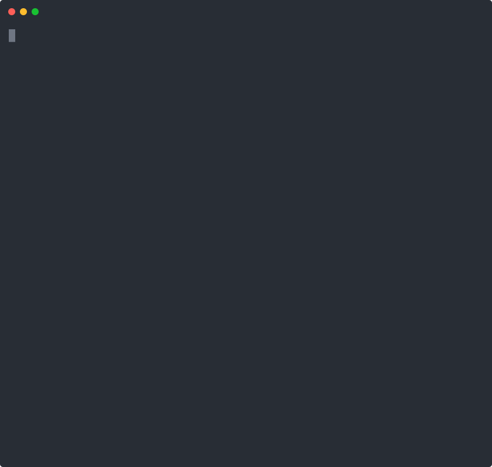
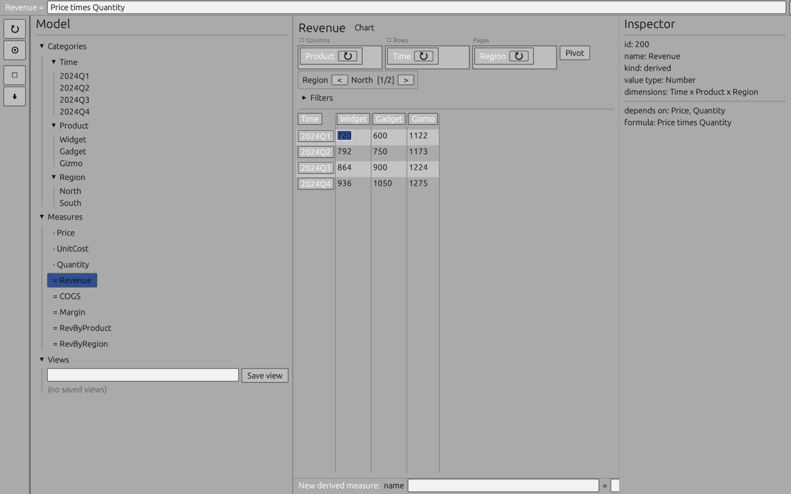
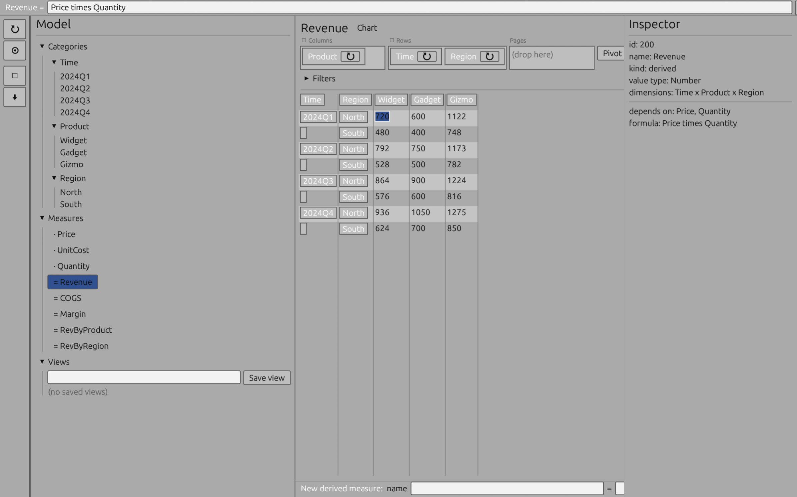

# Improv

A cross-platform, standalone **multidimensional spreadsheet** in Rust, inspired
by Lotus Improv and Quantrix. Improv separates *structure*, *logic*, and *data*:
you model in named **categories**, **items**, and **measures** instead of cell
coordinates, and derived values flow from a **differential-dataflow** graph so
recalculation is always incremental.

- **Modeling first, grid second.** Think in dimensions (Time, Product, Region),
  not rows and columns.
- **Always-incremental recalculation.** Each measure is a materialized view;
  edits propagate as deltas through differential dataflow.
- **Durable, scriptable, auditable.** The model persists as immutable facts in
  an embedded (SQLite-backed) [Mentat](https://codeberg.org/gregburd/mentat)
  datom store.
- **Four ways in.** A scriptable **CLI**, a VisiCalc-style **TUI**, a desktop
  **GUI** (pivoting, charts, saved views, filters), and a JSON **HTTP server** —
  all over the same model. Controlled-natural-language formulas too.

> See [`.agent/AGENT_STEERING.md`](.agent/AGENT_STEERING.md) for live phase
> status and [`.agent/steering/`](.agent/steering/) for the design.

## The idea, in one formula

```text
Revenue[Time, Product] = Price[Product] * Quantity[Time, Product]
```

`Price` is broadcast over `Time`; `Revenue` recomputes only for the cells an
edit actually touches. `SUM(Revenue OVER Time)` aggregates to `Revenue[Product]`.

## Workspace layout

| Crate | Binary | Purpose |
|-------|--------|---------|
| `improv_core_model` | — | Categories, items, measures, coordinates, formulas, values, saved views/filters. GUI/storage-free. |
| `improv_storage_mentat` | — | Persistence: model ⇄ datoms on embedded Mentat (SQLite). |
| `improv_storage_sql` | — | SQL import/export + live-query refresh (SQLite and PostgreSQL). |
| `improv_engine` | — | Formula compiler (`Formula → TypedExpr → PlanNode`) + differential-dataflow evaluation. |
| `improv_extfn` | — | External-language function runtime (isolated Python subprocess). |
| `improv_nl_formula` | — | Controlled-natural-language ⇄ formula translation. |
| `improv_cli` | `improv` | Command-line tool. |
| `improv_tui` | `improv-tui` | VisiCalc-style terminal pivot viewer. |
| `improv_server` | `improv-server` | JSON HTTP API over a model store. |
| `improv_gui` | `improv-gui` | egui/eframe desktop app. |

## Setup

With [Nix](https://nixos.org) (flakes): `nix develop` drops you into a dev shell
with the right Rust toolchain, the GUI runtime libraries (Wayland/X11/libGL) on
`LD_LIBRARY_PATH`, and the tooling (`nextest`, `deny`, `mdbook`, `typos`,
`sqlite3`, `asciinema`). A `.envrc` (`use flake`) makes `direnv` load it
automatically. The desktop GUI needs those libs, so run it from inside the shell.

```sh
cargo build --workspace
cargo test  --workspace
```

Without Nix you need a Rust toolchain (MSRV **1.97**) and, for the GUI, the
usual Wayland/X11/libGL development libraries; the external-function runtime
needs `python3` on `PATH`.

---

## CLI (`improv`)

A headless, scriptable driver over a model file. Full command list:

```sh
cargo run -p improv_cli -- help
```

| Command | What it does |
|---------|--------------|
| `init <db>` | Create an empty model. |
| `add-category <db> <id> <name>` | Add a dimension. |
| `add-item <db> <id> <cat-id> <name>` | Add an item to a category. |
| `add-measure <db> <id> <name> <number\|boolean\|text> input [Category ...]` | Add an input measure over the named categories. |
| `add-derived <db> <id> <name> <formula>` | Add a formula measure. |
| `define <db> <id> "<Target = ...>"` | Add a measure from a definition string (formula or `CALL(...)` form). |
| `set <db> <measure-id> <value> [--at Cat=Item,...]` | Set an input cell. |
| `list <db>` / `show <db> <measure-id>` | Inspect the model / one measure. |
| `eval <db> <measure-id>` | Compute a derived measure through the engine. |
| `export <db>` | Dump the model as JSON. |
| `import-sql` / `refresh-sql` / `export-sql` | SQL ⇄ measure (see below). |
| `refresh-all <db> [source.sqlite]` | Refresh every external-sourced measure (CALL + SQL) at once. |
| `serve-refresh <db> [source.sqlite] [--tick SECS]` | Daemon that honors each measure's refresh policy (on-load / interval). |
| `register-ext <db> <name> <arity> "<python body>"` | Register a pure Python function. |
| `refresh-ext <db> <measure-id>` | Populate a `CALL(...)` measure host-side. |

### Try it — the revenue model

```sh
cargo run -p improv_cli -- init model.db
cargo run -p improv_cli -- add-category model.db 1 Time
cargo run -p improv_cli -- add-category model.db 2 Product
cargo run -p improv_cli -- add-item model.db 10 1 2025
cargo run -p improv_cli -- add-item model.db 11 1 2026
cargo run -p improv_cli -- add-item model.db 20 2 WidgetA
cargo run -p improv_cli -- add-item model.db 21 2 WidgetB
cargo run -p improv_cli -- add-measure model.db 100 Price number input Product
cargo run -p improv_cli -- add-measure model.db 101 Quantity number input Time Product
cargo run -p improv_cli -- set model.db 100 10 --at Product=WidgetA
cargo run -p improv_cli -- set model.db 100 20 --at Product=WidgetB
cargo run -p improv_cli -- set model.db 101 100 --at Time=2025,Product=WidgetA
cargo run -p improv_cli -- set model.db 101 120 --at Time=2026,Product=WidgetA
cargo run -p improv_cli -- define model.db 102 "Revenue = Price * Quantity"
cargo run -p improv_cli -- eval model.db 102
cargo run -p improv_cli -- define model.db 103 "TotalRevenue = SUM(Revenue OVER Time)"
cargo run -p improv_cli -- eval model.db 103
```

The whole flow, recorded: **[`docs/demo/cli-demo.cast`](docs/demo/cli-demo.cast)**
(play with `asciinema play docs/demo/cli-demo.cast`, or re-record with
[`docs/demo/cli-demo.sh`](docs/demo/cli-demo.sh)).

**Incremental recalculation**, recorded: build a model, then flow in new numbers
and watch the derived measures recompute:



Raw cast: **[`docs/demo/recalc-demo.cast`](docs/demo/recalc-demo.cast)**
(`asciinema play docs/demo/recalc-demo.cast`; re-record with
[`docs/demo/recalc-demo.sh`](docs/demo/recalc-demo.sh); the SVG above is rendered
from the cast with `svg-term`).

For a richer playground — a 3-D **Time × Product × Region** sales model with
Price/Cost/Quantity inputs and Revenue/COGS/Margin + aggregated derived measures
— run [`docs/demo/sample-model.sh`](docs/demo/sample-model.sh):

```sh
bash docs/demo/sample-model.sh sample.db
nix develop -c cargo run -p improv_gui -- sample.db
```

In the GUI: select `Revenue`, then drag the **Region** tile onto the Rows
margin to stack it under Time (nested row headers), or onto Pages to slice by
region; toggle the chart, save a view, or filter Product to a subset.

### SQL and external functions

```sh
# Import a SQLite query into a measure; refresh re-runs the query.
cargo run -p improv_cli -- import-sql model.db sales.db 300 Sales \
    "SELECT t,p,r FROM sales" r t:1:Time p:2:Product
cargo run -p improv_cli -- refresh-sql model.db sales.db 300

# A pure Python function, evaluated host-side (never on the engine's hot path).
cargo run -p improv_cli -- register-ext model.db hypot 2 \
    "result = (args[0]**2 + args[1]**2) ** 0.5"
cargo run -p improv_cli -- define model.db 200 "H = CALL(hypot, Price, Price)"
cargo run -p improv_cli -- refresh-ext model.db 200
```

`storage_sql` also speaks **PostgreSQL**; connection descriptors keep credentials
out of band (a password-less DSN plus an env-var name resolved at connect time).

---

## TUI (`improv-tui`)

A terminal pivot viewer over an existing model file:

```sh
cargo run -p improv_tui -- model.db
```

| Key | Action |
|-----|--------|
| arrows / mouse click | Move the cell cursor |
| `e` / `Enter` | Edit the selected cell |
| `[` / `]` | Page through extra (page) dimensions |
| `p` | Pivot (rotate the axis order) |
| `f` / `F` | Toggle a filter on the cursor's row item / clear all filters |
| `S` | Save the current layout as a view |
| `v` | Cycle through saved views |
| `Tab` / `m` | Cycle the measure shown |
| `q` | Quit (autosaves) |

Run against the `model.db` built above to see `Revenue` pivoted over
Time × Product.

---

## GUI (`improv-gui`)

The egui/eframe desktop app in the NeXTSTEP-flavored look-and-feel of the
original Lotus Improv — explorer, editable pivot grid, on-grid margin **category
tiles** for drag-to-pivot, a top **formula bar**, inspector, saved views,
per-category filters, a bar/line **chart**, and **multi-category-per-axis
stacking**.



*The 3-D sample model: Revenue over Time × Product × Region. Product is on
columns, Time on rows, Region paged (North [1/2]); the formula bar shows
`Revenue = Price times Quantity`, and the inspector shows its dependencies.*



*The same measure after dragging **Region** onto the Rows margin: rows are now
the stacked product Time × Region (2024Q1 North/South, 2024Q2 …), with the outer
Time label printed once per group.*

Run it from inside the Nix dev shell (it needs the GUI runtime libs):

```sh
nix develop -c cargo run -p improv_gui -- model.db
# or build the richer sample model first:
bash docs/demo/sample-model.sh sample.db && \
  nix develop -c cargo run -p improv_gui -- sample.db
```

Grid keyboard navigation (mouse also works throughout):

| Key | Action |
|-----|--------|
| arrows / `hjkl` | Move the cell cursor |
| `Enter` / `F2` | Edit the selected cell |
| `[` / `]` (or `PageUp` / `PageDown`) | Page the first page dimension |
| `n` / `Shift+n` | Cycle the measure forward / back |

`Tab` is reserved by egui for focus, so measures cycle on `n`.

---

## Server (`improv-server`)

A JSON HTTP API over a model store (default `127.0.0.1:3000`; override with
`IMPROV_ADDR` or a second arg):

```sh
cargo run -p improv_server -- model.db
# then, e.g.
curl -s localhost:3000/measures
curl -s -X POST localhost:3000/measures/102/eval
```

Routes: `/health`, `/model`, `/measures`, `/measures/:id/{values,eval,cells}`,
`/nl/parse`, `/nl/describe`.

---

## Development

See [`CONTRIBUTING.md`](CONTRIBUTING.md). The quality gate (all warning-free):

```sh
cargo fmt --all -- --check
cargo clippy --all-targets --all-features -- -D warnings
cargo test --workspace
cargo deny check
typos
```

Documentation lives in [`docs/`](docs/) (mdBook) and a man page at
[`docs/man/improv.1`](docs/man/improv.1).

## License

Licensed under either of [Apache-2.0](LICENSE-APACHE) or [MIT](LICENSE-MIT) at
your option.
