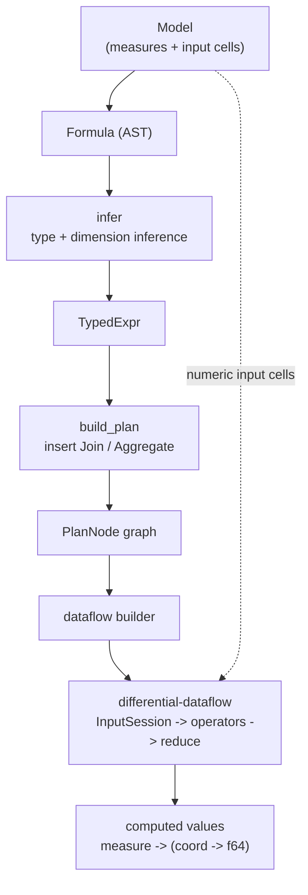

# Architecture & Design

Improv is a small Cargo workspace. Each crate has one job and depends only on
the ones below it.

## Crate layout

| Crate | Package | Purpose | Status |
|-------|---------|---------|--------|
| `core_model` | `improv_core_model` | Categories, items, measures, coordinates, formulas, values. GUI/storage-free. | Done |
| `storage_mentat` | `improv_storage_mentat` | Model ⇄ datoms on embedded (SQLite) Mentat. | Done |
| `engine` | `improv_engine` | Formula compiler + differential-dataflow evaluation. | Done (numeric core) |
| `nl_formula` | `improv_nl_formula` | Controlled-natural-language ⇄ formula translation. | Done (initial grammar) |
| `cli` | `improv_cli` | The `improv` command-line tool. | Done (headless subset) |
| *(tui)* | `improv_tui` | VisiCalc-style terminal pivot viewer. | Done |
| *(server)* | `improv_server` | JSON HTTP API over a model store. | Done |
| *(gui)* | `improv_gui` | Desktop GUI (pivoting, charts, views, filters). | Done |
| *(storage_sql)* | `improv_storage_sql` | SQL import/export + refresh (SQLite, PostgreSQL). | Done |
| *(extfn)* | `improv_extfn` | External-language function runtime (Python). | Done (Python) |

## The computation pipeline

A derived measure's formula is compiled through a typed intermediate form into
an operator plan, which is then built into a differential-dataflow graph and
run. Input cells are fed as data; computed values come back out.

The two compiler passes (`infer`, `build_plan`) live in
`engine::compiler`; the plan node types in `engine::plan`; the dataflow builder
and the one-shot `evaluate` entry point in `engine::dataflow`.

`PlanNode` kinds map onto differential-dataflow operators:

| `PlanNodeKind` | Dataflow operator |
|----------------|-------------------|
| `InputMeasure` | an `InputSession` collection |
| `MapUnary`     | `map` |
| `MapBinary`    | `join` on coordinate key, then `map` element-wise |
| `Join`         | re-key both sides to shared categories, `join`, rebuild the union key |
| `Aggregate`    | re-key to the group-by coordinate, then `reduce` (SUM/AVG/MIN/MAX) |

A final `reduce` collapses each key to a single value before results are
captured.

## Why differential dataflow

Differential dataflow is a hard requirement of the design: the engine computes
incrementally, so an edit propagates as a **delta** and only the affected cells
recompute. The engine's spike (`dd_revenue_is_incremental`) proves this: after
computing `Revenue = Price * Quantity`, it changes one `Quantity` cell and
confirms the matching `Revenue` cell updates while an unaffected cell does not
recompute.

The version pin is deliberate and delicate — `differential-dataflow =
"=0.13.0"` with `timely = "=0.13.0"`. Newer DD pulls a timely line that does
not compile on the project's rustc; an older DD compiles but aborts on a
`merge_batcher` bug under debug assertions. `0.13.0` is the pair that both
compiles and runs. Do not bump it without re-validating.

## The coordinate / value encoding for dataflow

Differential dataflow requires its data to be fixed, ordered, hashable, and
exchangeable (`Abomonation`). The model's `Coordinate` is a dynamic-arity
`BTreeMap` and `Value` carries an `f64`, neither of which satisfies that
directly. The engine encodes at the dataflow boundary:

- **Key** — a coordinate becomes a sorted `Vec<(u32, u32)>` of
  `(category_id, item_id)` pairs (`CoordKey`). The `BTreeMap` already iterates
  in sorted order, so the encoding is deterministic, `Ord + Hash`, and
  exchange-safe. `encode_coord` / `decode_coord` convert at the edge;
  `project_key` narrows a key to a subset of categories (used for joins and
  group-bys).
- **Value** — a numeric cell's `f64` is stored as its bit pattern
  (`f64::to_bits()` → `u64`) in the data position, and decoded with
  `f64::from_bits`. This keeps the value a primitive, exchange-safe scalar; the
  arithmetic happens after decoding inside `map`/`reduce` closures.
- **Diff** — the differential multiplicity `R` stays `isize`.

This encoding is what cleared the project's Phase 1 viability gate.

## Determinism

The core engine is deterministic and unit/property tested. The `Time × Product`
revenue model (with results 1000 / 1000 / 1200 / 1600) is the canonical fixture
checked by `engine`'s tests, and each crate carries its own test module.
